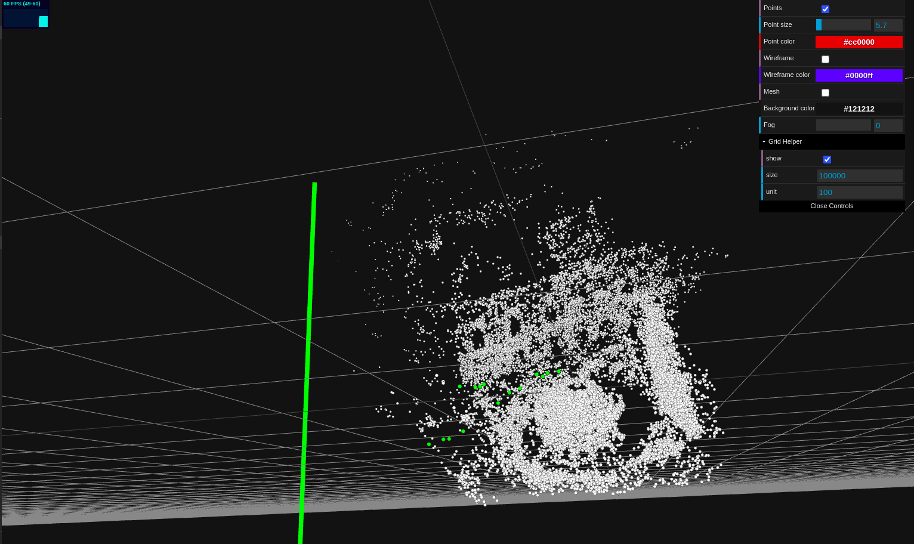
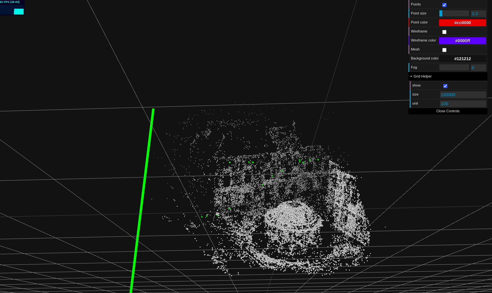

# BUNDLE ADJUSTMENT USING CERES

## Running the code
### Build the file using
```
cd ~/ws
mkdir build
cd build
cmake ..
make
```
### Then to run on BAL the dataset given in problem-16-22106-pre.txt

```
cd ~/ws
./build/bundle_adjustment_ceres problem-16-22106-pre.txt
```


## Results

### Output will be like-

```
Header: 16 22106 83718normalized
bal problem file loaded...
bal problem have 16 cameras and 22106 points. 
Forming 83718 observations. 
Solving ceres BA ... 
iter      cost      cost_change  |gradient|   |step|    tr_ratio  tr_radius  ls_iter  iter_time  total_time
   0  1.842900e+07    0.00e+00    2.04e+06   0.00e+00   0.00e+00  1.00e+04        0    7.36e-02    2.43e-01
   1  1.449093e+06    1.70e+07    1.75e+06   2.16e+03   1.84e+00  3.00e+04        1    1.51e-01    3.94e-01
   2  5.848543e+04    1.39e+06    1.30e+06   1.55e+03   1.87e+00  9.00e+04        1    1.42e-01    5.37e-01
   3  1.581483e+04    4.27e+04    4.98e+05   4.98e+02   1.29e+00  2.70e+05        1    1.37e-01    6.74e-01
...
                                     Original                  Reduced
Parameter blocks                        22122                    22122
Parameters                              66462                    66462
Residual blocks                         83718                    83718
Residuals                              167436                   167436

Minimizer                        TRUST_REGION

Sparse linear algebra library    SUITE_SPARSE
Trust region strategy     LEVENBERG_MARQUARDT

                                        Given                     Used
Linear solver                    SPARSE_SCHUR             SPARSE_SCHUR
Threads                                     1                        1
Linear solver ordering              AUTOMATIC                 22106,16
Schur structure                         2,3,9                    2,3,9

Cost:
Initial                          1.842900e+07
Final                            1.233697e+04
Change                           1.841667e+07

Minimizer iterations                       51
Successful steps                           37
Unsuccessful steps                         14

Time (in seconds):
Preprocessor                         0.173279

  Residual only evaluation           0.567425 (36)
  Jacobian & residual evaluation     2.116399 (37)
  Linear solver                      2.994651 (50)
Minimizer                            6.218801

Postprocessor                        0.005645
Total                                6.397725

Termination:                   NO_CONVERGENCE (Maximum number of iterations reached. Number of iterations: 50.)
```

### Visualizing the point clouds from initial.ply and final.ply file
#### Initial PCL

#### Final PCL. We can see the difference in the structure which is much clearer and sharper now

